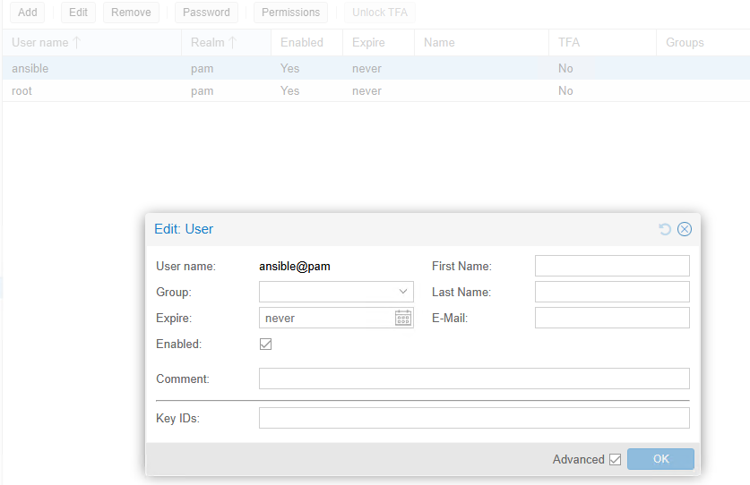
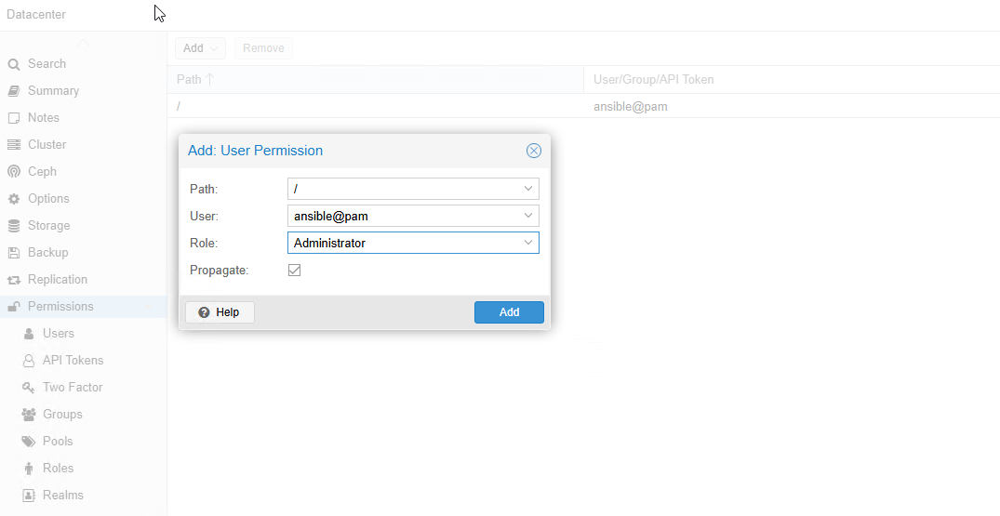
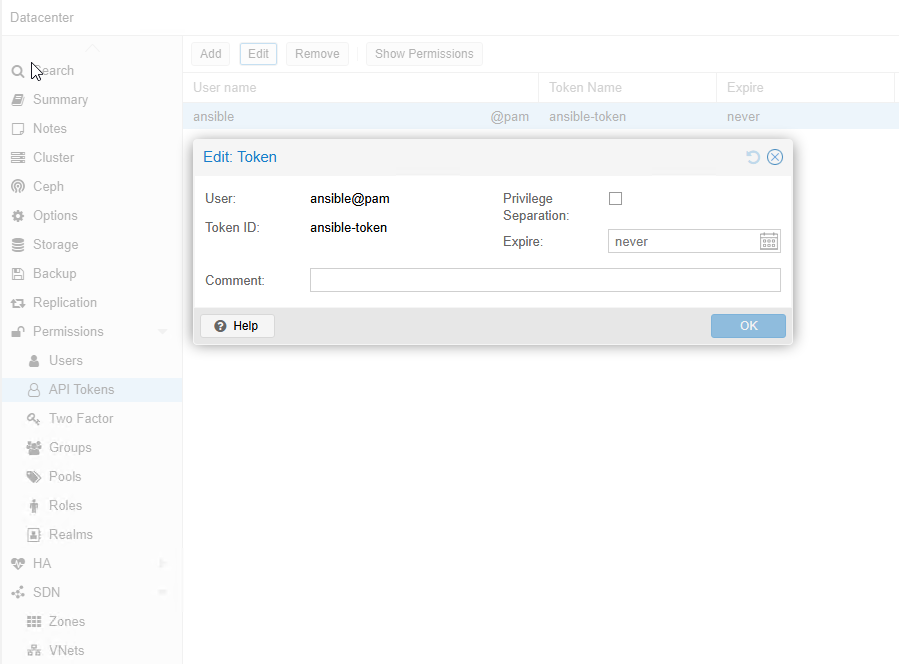

## Подробное описание:

**1.** Необходимо создать пользователя в разделе `Users`      
    

**2.** Неободимо предоставить права доступа в разделе `Permissions`  
    

**3.** Необходимо создать токен в разделе `API Tokens`       
  

**4.** Необходимо выдать права на выполнение команд от имени `sudo` без запроса пароля, прописать следующую конфигурацию в /etc/sudoers.d/
```console
# visudo -f /etc/sudoers.d/ansible-conf - команда для создания конфигурации в /etc/sudoers.d
ansible ALL=(ALL) NOPASSWD: ALL
# Редактировать конфигурации которые влияет на sudo без visudo считается грязной практикой и в корне не рекомендуется для использования!
# Помимо этого необходимо убедиться существует ли вами созданный пользователь в консоли с помощью команды `id`, если нет необходимо его создать!
```

**5.** Необходимо создать SSH-ключи которые будут использоваться для подключение к Proxmox, и ключи которые при настройке будут переданы в template через `cloud-init`.      
- Ключи SSH которые будут использоваться для подключения к `Proxmox`. Данный тип ключей необходимо указывать в `~/username/.ssh/config` на ansible контроллере.
```console
# vi ~/.ssh/config
Host 10.10.10.10 20.20.20.20
        HostName %h
        User ansible
        IdentityFile ~/.ssh/ssh-key
```
- Помимо этого в inventory в `hosts.ini` необходимо будет указать метод подключения по SSH
```console
[proxmox_nodes]
proxmox-node1-pve ansible_host=10.10.10.10 ansible_user=ansible ansible_connection=ssh
proxmox-node2-pve ansible_host=10.10.10.11 ansible_user=ansible ansible_connection=ssh
```

- Ключи SSH которые будут переданы к создаваемым виртуальным машинам, указанные в `roles/infra/proxmox-cloud-init-vm/defaults/main.yml`
```console
ssh_key_filename: "/home/user/.ssh/ansible.pub"  # Ключ который закидывается через qm set
```
 Подключение к `Proxmox` по SSH обусловлено тем что передачу SSH - ключей для конечных машин бесшевно через API мне не удалось реализовать, оставлять постоянно один ключ создав его через `GUI Proxmox` мне показалось недостаточно гибким, поэтому было принято решение реализовать передачу через утилиту `qm`. Если вдаваться в детали, то прописанный заранее Вами пользоавтель подключается к `Proxmox` по SSH, берет указанные ключи из  `ssh_key_filename: "/home/user/.ssh/ansible.pub"` и прописывает его в конфигурации виртуальной машины с помощью утилиты `qm` по пути конфигурации машины в Proxmox `/etc/pve/qemu-server/id.conf`.   

**6.** Для корректной работы роли, шаблон ВМ (template) должен соответствовать следующим условиям:
- `Cloud-Init` диск должен быть подключен как `ide2`: `ide2: local-lvm:cloudinit, media=cdrom`. Если `Cloud-Init` подключен как `scsi1` то параметры вроде `--ciuser`, `--ipconfig0`, `--sshkeys` не применяются в `Proxmox`
- Тип основого диска - `scsi0` с `virtio-scsi-single:`
```console
scsi0: local-lvm:vm-<ID>-disk-0,size=12G
scsihw: virtio-scsi-single
```
- В шаблоне внутри ОС должен быь установлен пакет `cloud-init`
- Очистить конфигурации в `/etc/netplan`. Если в шаблоне присутствуют лишние `.yaml` файлы в `/etc/netplan`, то `CLoud-Init` может не применить настройки сети. 
- Пример как должен выглядить конечный рабочий template.
```console
boot: order=sata0;ide2;net0
cores: 4
cpu: x86-64-v2-AES
ide2: datastore-2:vm-110-cloudinit,media=cdrom
memory: 2048
meta: creation-qemu=8.1.5,ctime=1744013398
name: debian-test-clone
net0: virtio=BC:24:11:62:A4:D8,bridge=br-vlan0000
numa: 0
ostype: l26
sata0: datastore-2:base-110-disk-0,size=32G
scsihw: virtio-scsi-single
smbios1: uuid=362ead97-1c8d-429e-bb94-435e93057dc3
sockets: 1
template: 1
vmgenid: b5411159-917e-4bde-9f69-0f4f1986f6bd
```